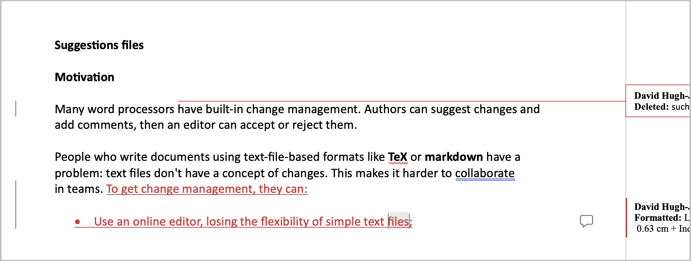

<!--
To rebuild index.md, run:

  pandoc index.md -t html --ascii -o index.html

-->
<link rel="stylesheet" href="simple.css">

# Suggestions files

## Motivation

Many word processors have built-in change management. 
Authors can suggest changes and add comments,
then an editor can accept or reject them.

{width=100%}

People who write documents using text-file-based formats like **TeX** or
**markdown** have a problem: text files don't
have a concept of changes. This makes it harder to collaborate
in teams. To get change management, they can:

* Use an online editor, losing the flexibility of simple text files;
* Use a version control system like **git**, which is complex and technical.

*Suggestions files* are a standard for changes for plain text. They let
authors collaborate, suggest and review changes. They don't
require any special software, and they can be used on any kind
of text file. You just edit the file as usual, and follow some 
simple rules.

## Making suggestions

To suggest new text to add to a file, enclose it in `++[` and `]++` tags like this:

    The original text, ++[your suggested addition,]++ 
    and more text.

To suggest a deletion from a file, enclose it in `--[` and `]--` tags like this:

    The original text, --[the section you want to delete,]-- 
    and more text.

To make a comment, enclose it in `%%[` and `[%%`:

    %%[ This clarifies the argument, right? @stephen ]%%

You can sign the comment with a `@handle` as the last word.

## Reviewing suggestions

To review suggestions:

* To accept a suggested addition, delete the `++[` and matching `]++`, leaving 
  everything between them.
* To accept a suggested deletion, delete everything between `--[` and `]--` inclusive.

Rejecting suggestions is just the other way round:

* To reject an addition, delete everything between `++[` and `]++` inclusive.
* To reject a deletion, delete the `--[` and matching `]--`.

You can also delete comments. Typically, you will have to do this before
using the text file for another purpose.

If a tag (`++[`, `]++`, `--[`, `]--`, `%%[` or `]%%`) is on its own on a line,
treat the subsequent newline as part of the tag and delete it:

    A paragraph of text.
    ++[
    A new line.
    ]++
    The paragraph continues.

becomes

    A paragraph of text.
    A new line.
    The paragraph continues.

if the addition is accepted, or

    A paragraph of text.
    The paragraph continues.

if it is rejected.

## Multiple authors and nested suggestions

If multiple authors are working on a document, you may want to 
sign your suggested changes. Do that by putting your handle
at the end of the change, just like for a comment. The handle
must start with `@` and must be the last word:

       And God said, 
    --[Light be made, and the light was made. @tyndale]-- 
    ++[Let there be lyghte and there was lyghte. @tyndale]++
    ++[Let there be light: and there was light. @kjv]++
    
You can nest suggestions within each other:

    Last night I dreamt I went to Manderley++[, the famous 
    ++[Cornish @editor]++ seaside resort, @daphne ]++ again.

You can't nest changes within comments (too confusing). If you 
want to add to a comment, just write inside it with your handle.
It's only a comment anyway.

The rules for reviewing nested comments are the same as above.
You may need to adjudicate between different alternatives. Obviously,
if you accept someone's deletion, any other suggestions inside it
will be deleted and be irrelevant.

## Why not just use a diff file?

`diff` is a command that prints the difference between two text files.
It's widely used in the computing world. But diffs are designed for 
computers and code, not humans and text:

* Diff output makes no sense without the original file. You can't read changes 
  in their original context. A suggestions file shows additions and deletions
  in context; it can be sent as an email attachment, read and understood.
* Using and applying diffs requires command line tools. This is hard for
  non-technical authors. Suggestions files 
  don't require any command line tools, but you can 
  [use one](https://github.com/hughjonesd/suggestions) if you like.
* Diffs are typically line oriented. This makes them hard to read 
  when only a word or phrase has changed.
* You can't put comments and authorship in a diff file.
* A diff file only shows one set of changes. A suggestions file can show changes by
  multiple authors, including nested changes.

## Command line tool

There is a command line tool `suggs` for working with suggestions files.

You can use it like this:

    suggs colorize file.txt

Prints suggestions file *file.txt* with additions, deletions and comments shown in 
color.

    suggs new file.txt

Prints *file.txt* with all suggestions accepted.

    suggs old file.txt

Prints *file.txt* with all suggestions rejected.

    suggs accept file.txt
    suggs reject file.txt

Accepts or rejects all changes in-place, writing the result back to *file.txt*. 

    suggs diff old.txt new.txt

Creates a suggestions file from the difference between *old.txt* and *new.txt*.

## Tips

If you write comments like

    %%[
    % My comment here.
    % ]%%

then TeX will also treat them as comments.

